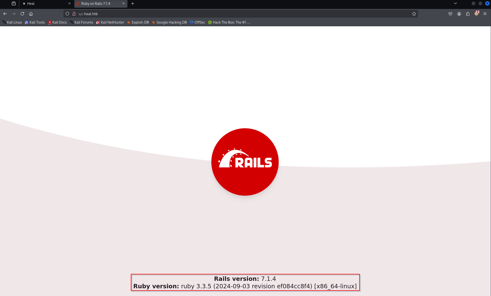

### Target: 10.10.10.245 - Cap
### Special Notes:
N/A

#### Start off with an nmap scan of tcp and udp:
```sudo nmap -sS -sV -Pn -p- -T4 -oN $target.nmap -vvv --min-rate 1000 $target```

```sudo nmap -sU $target --defeat-icmp-ratelimit -p- -oN $target.nmap -vvv --min-rate 1000 -T5```


#### Nmap TCP Results
```

```

#### Nmap UDP Results
```

```

#### Notes

searched for vhosts:
```
└─# ffuf -w /usr/share/seclists/Discovery/Web-Content/raft-small-directories.txt -H "Host: FUZZ.heal.htb" -u http://heal.htb -mc 200

        /'___\  /'___\           /'___\       
       /\ \__/ /\ \__/  __  __  /\ \__/       
       \ \ ,__\\ \ ,__\/\ \/\ \ \ \ ,__\      
        \ \ \_/ \ \ \_/\ \ \_\ \ \ \ \_/      
         \ \_\   \ \_\  \ \____/  \ \_\       
          \/_/    \/_/   \/___/    \/_/       

       v2.1.0-dev
________________________________________________

 :: Method           : GET
 :: URL              : http://heal.htb
 :: Wordlist         : FUZZ: /usr/share/seclists/Discovery/Web-Content/raft-small-directories.txt
 :: Header           : Host: FUZZ.heal.htb
 :: Follow redirects : false
 :: Calibration      : false
 :: Timeout          : 10
 :: Threads          : 40
 :: Matcher          : Response status: 200
________________________________________________

api                     [Status: 200, Size: 12515, Words: 469, Lines: 91, Duration: 100ms]
API                     [Status: 200, Size: 12515, Words: 469, Lines: 91, Duration: 97ms]
```

added api.heal.htb to my hosts

found webpage:

